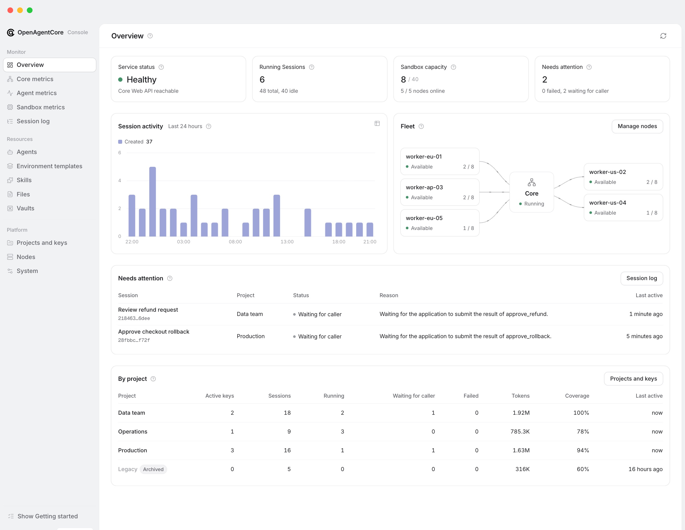
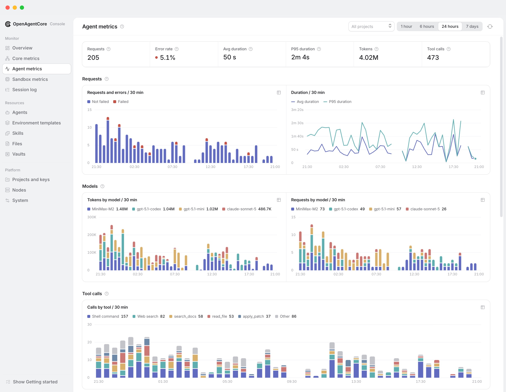

<div align="center">


# OpenAgentCore

An open-source, self-hosted implementation of the OpenAI Agents API with multiple native harnesses.

[Install](#install) · [Call the API](docs/getting-started/quickstart.md) · [Documentation](#documentation) · [Contributing](CONTRIBUTING.md)

**English** · [简体中文](README.zh-CN.md)

</div>

## What it is

OpenAgentCore runs AI agents on your own infrastructure behind the OpenAI Agents API.

- **Same API as OpenAI.** Point the official OpenAI SDK, or plain HTTP, at your installation. No new client to learn.
- **Your choice of agent.** Each Session runs a native harness: Codex, Claude Code or MiniMax Code, with the model provider you configure.
- **Your choice of machine.** Agents work in a managed sandbox (Docker, microsandbox or E2B), or on your own Linux, macOS or Windows machine.
- **Every part is replaceable.** Sandboxes, harnesses and model providers plug in through defined protocols.

## Screenshots

| Overview | Agent metrics |
| --- | --- |
|  |  |

## Install

On a Linux amd64 host with Docker and Python 3.9+:

```sh
curl -fsSL https://github.com/MiniMax-AI/OpenAgentCore/releases/latest/download/install.sh | bash
```

Then:

1. **Sign in to Web**, the admin console, with the Core key the installer created, and **configure the domain and HTTPS**.
2. **Set a default model** and **issue a Project API key**.
3. **Add execution capacity:** a node, E2B, or your own machine.
4. **[Run your first Session](docs/getting-started/quickstart.md)** with the OpenAI SDK.

The [installation guide](docs/getting-started/install.md) covers each step, HTTPS and a quick local trial. Listen addresses, ports and other options: [installation options](docs/getting-started/install-options.md).

## How it fits together


Applications and operators use these Core APIs:

| API | Path | Used by |
| --- | --- | --- |
| **[Agents API](docs/api/public-agent-api.md)** | `/v1` | Your applications. Same protocol as [OpenAI's Agents API](https://developers.openai.com/api/docs/guides/agents-api/overview) |
| **[Core API](contracts/agents-api/admin-api.md)** | `/core/v1` | Operators, through Web |

Core keeps durable execution state. The Runtime runs the chosen harness inside the Environment. Each connection is a defined protocol, so any part can be replaced on its own. See the [architecture guide](docs/architecture.md).

## Documentation

| I want to | Start with |
| --- | --- |
| Install and operate an installation | [Installation](docs/getting-started/install.md), then [operations](docs/getting-started/operations.md) |
| Build an application on the API | [Quickstart](docs/getting-started/quickstart.md), then the [Agents API guide](docs/api/public-agent-api.md) |
| See a complete application | [Examples](docs/examples.md) |
| Run agents on my own machine | [Self-hosted execution](docs/getting-started/self-hosted.md) |
| Check Harness capabilities and limits | [Harness capabilities](contracts/agents-api/harness-capabilities.md) |
| Understand the design | [Architecture](docs/architecture.md) |
| Add a sandbox, harness or other component | [Developer guide](docs/development.md) |

All pages: [documentation index](docs/getting-started/index.md). Before changing code, read the [contributor rules](CONTRIBUTING.md).
