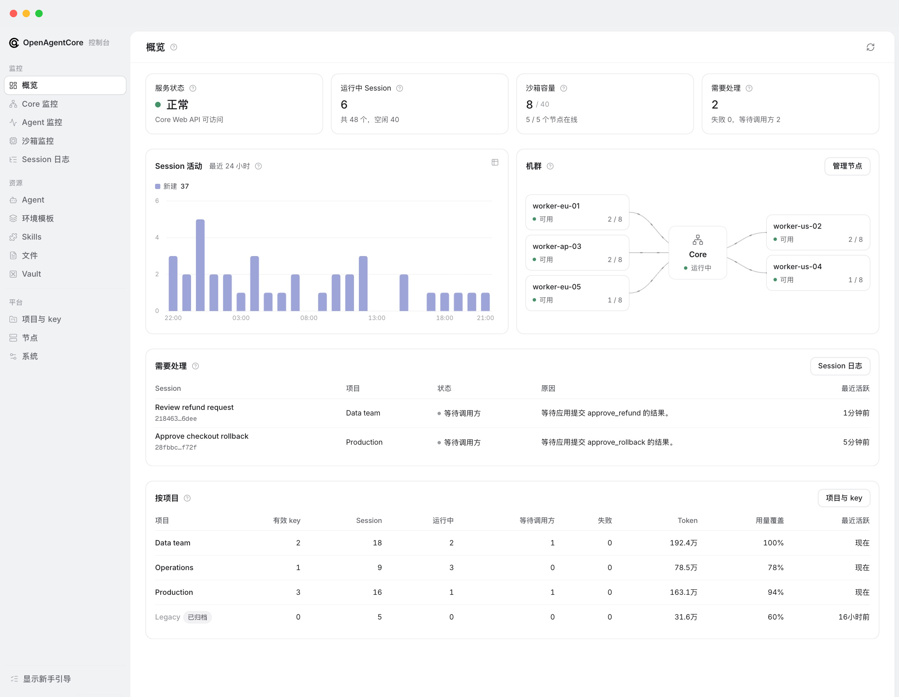
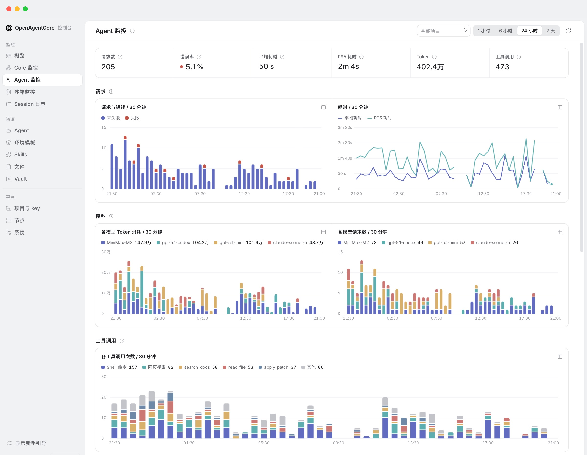

<div align="center">


# OpenAgentCore

OpenAI Agents API 的开源实现，支持多种原生执行引擎，可部署在自己的基础设施上。

[安装](#安装) · [调用 API](docs/getting-started/quickstart.md) · [文档](#文档) · [参与贡献](CONTRIBUTING.md)

[English](README.md) · **简体中文**

</div>

## 这是什么

OpenAgentCore 在你自己的基础设施上运行 AI Agent，对外提供 OpenAI Agents API。

- **与 OpenAI 相同的 API。** 官方 OpenAI SDK 或直接 HTTP 调用，改一下地址即可，无需学习新客户端。
- **自选 Agent。** 每个 Session 运行一个原生 Harness：Codex、Claude Code 或 MiniMax Code， 使用你配置的模型供应商。
- **自选机器。** Agent 可以在托管沙箱（Docker、microsandbox 或 E2B）里工作， 也可以在你自己的 Linux、macOS 或 Windows 机器上工作。
- **每个部件都可替换。** 沙箱、Harness 和模型供应商都通过既定协议接入。

## 界面预览

| 概览 | Agent 监控 |
| --- | --- |
|  |  |

## 安装

在已准备 Docker 和 Python 3.9+ 的 Linux amd64 主机上：

```sh
curl -fsSL https://github.com/MiniMax-AI/OpenAgentCore/releases/latest/download/install.sh | bash
```

然后：

1. 用安装器生成的 Core key **登录 Web**（管理控制台），并**配置域名和 HTTPS**。
2. **设置默认模型**，并**签发 Project API key**。
3. **添加执行资源**：节点、E2B，或你自己的机器。
4. 用 OpenAI SDK **[运行第一个 Session](docs/getting-started/quickstart.md)**。

[安装指南](docs/getting-started/install.md)详细介绍每一步，以及 HTTPS 配置和本地快速试用。监听地址、端口等参数见[安装配置选项](docs/getting-started/install-options.md)。

## 组件关系


应用和管理员使用以下 Core API：

| API | 路径 | 调用方 |
| --- | --- | --- |
| **[Agents API](docs/api/public-agent-api.md)** | `/v1` | 你的应用，与 [OpenAI 的 Agents API](https://developers.openai.com/api/docs/guides/agents-api/overview) 协议一致 |
| **[Core API](contracts/agents-api/admin-api.md)** | `/core/v1` | 管理员，通过 Web 调用 |

持久化执行状态由 Core 保存；Runtime 在 Environment 中运行所选 Harness。各部件之间都通过既定协议连接， 任何一个都可以单独替换。详见[架构说明](docs/architecture.md)。

## 文档

| 我想要 | 从这里开始 |
| --- | --- |
| 安装并运维 | [安装指南](docs/getting-started/install.md)，然后看[运维](docs/getting-started/operations.md) |
| 基于 API 开发应用 | [快速开始](docs/getting-started/quickstart.md)，然后看 [Agents API 指南](docs/api/public-agent-api.md) |
| 看一个完整的应用 | [示例](docs/examples.md) |
| 在自己的机器上运行 Agent | [自托管执行](docs/getting-started/self-hosted.md) |
| 查看 Harness 能力和限制 | [Harness 能力](contracts/agents-api/harness-capabilities.md) |
| 了解设计 | [架构说明](docs/architecture.md) |
| 接入新的沙箱、Harness 或其他组件 | [开发指南](docs/development.md) |

全部文档见[文档目录](docs/getting-started/index.md)。修改代码前请阅读[贡献规范](CONTRIBUTING.md)。
