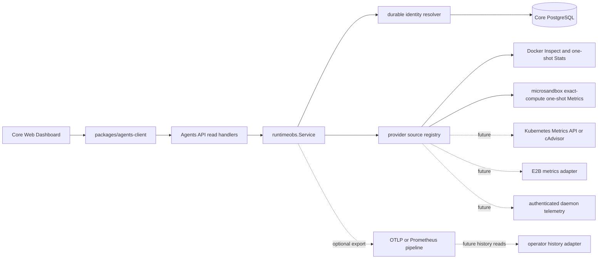

# Runtime observability and Dashboard design

Status: provider abstraction with Docker and microsandbox sampling, the
current-snapshot API/client contract, and the initial Core Web current-snapshot
Dashboard are implemented. Phase 4 backend qualification and the bounded,
sanitized exporter seam are implemented, but no concrete export transport,
history backend, or history API is configured. Other provider sources are not
implemented. Microsandbox idle suspension is a separate durable lifecycle
feature; it does not consume this telemetry as authority.

## 1. Problem statement

Operators need one Dashboard that answers four separate questions without
confusing their sources of truth:

1. Which Runtime instances currently belong to which tenant, Session, and
   Environment?
2. What compute is allocated and what is it consuming now?
3. How long has allocation, compute, and model work been active?
4. How many model tokens have been reported for the corresponding Sessions?

The design must work across managed Docker now and later managed Kubernetes,
E2B, and authenticated self-hosted Runtime deployments. Metrics are operational
evidence. They must not become execution or lifecycle authority.

## 2. Goals

- Resolve every sample through durable Core identity before provider access.
- Keep provider-specific collection behind one source interface.
- Preserve observed zero, unavailable measurements, and unsupported modes as
  different states.
- Provide a bounded read-only API suitable for Core Web and other operators.
- Let Web combine Runtime observations with existing Session and Turn usage
  without copying execution truth into the browser.
- Keep current snapshots independent from an optional history backend.
- Define a safe path to future idle shutdown without implementing it implicitly.

## 3. Non-goals

- Redefining the pinned OpenAI Agents resources.
- Adding product users, organizations, billing, or authorization tables to Core.
- Treating a Session, daemon socket, container, pod, native harness Session, or
  Turn as the same identity.
- Estimating missing CPU, memory, token, or duration values.
- Using telemetry, heartbeat age, low CPU, or Prometheus state to stop compute.
- Adding lifecycle actions to the first Dashboard release.
- Storing time-series samples in PostgreSQL.

## 4. Source-of-truth model

| Concern | Authority | Notes |
| --- | --- | --- |
| Tenant and Session ownership | Core database | Every public read is tenant-scoped. |
| Environment placement | Session configuration and Environment row | `none`, `self_hosted`, or `openai_hosted`. |
| Observation resource identity | Session ID | One current observation resource exists per tenant-owned Session. |
| Managed Runtime identity | `runtime_allocations` | Allocation and provider key identify the compute incarnation. |
| Self-hosted Runtime identity | Environment connection generation | Future telemetry must be generation-fenced. |
| Container/pod resource values | Selected provider source | Read-only, point-in-time evidence. |
| Turn state and busy duration | Core Turns | Never inferred from CPU. |
| Token usage | Existing Session/Turn usage | Missing native usage remains unknown. |
| Historical resource series | Optional telemetry backend | Not execution or lifecycle authority. |
| Idle shutdown decision | Future durable Core control state | Separate design and migration. |

## 5. Identity chain

```text
managed
tenant_id -> session_id -> environment_id -> runtime_allocation_id
          -> provider_key -> provider-owned container/pod/instance

self-hosted (future)
tenant_id -> session_id -> environment_id
          -> device_id + connection_generation -> authenticated Runtime report

none
tenant_id -> session_id
          -> no Session-owned Runtime instance
```

Provider-native identifiers are never accepted from browser input. The resolver
starts from the authorized tenant and Session, loads the committed Environment and
allocation, and only then selects the configured source by persisted provider key.
The provider independently verifies its labels or equivalent ownership metadata.

## 6. Component architecture



### 6.1 `runtimeobs`

Owns provider-neutral identity, mode resolution, source selection, sample
validation, and observation status. It must not import provider SDKs or mutate
Runtime lifecycle.

### 6.2 Provider sources

Each source receives a fully resolved target and returns one normalized sample.
A source must verify target ownership, make only bounded read calls, preserve
missing fields, return cumulative CPU seconds, and never create, renew, restart,
pause, or stop compute.

Docker uses Inspect followed by non-streaming one-shot Stats. Kubernetes should
retain pod UID, container identity, and restart boundaries. E2B must use an
API-supported instance identity rather than display names. Self-hosted metrics
require authenticated daemon messages fenced by the current connection generation.

Microsandbox uses the persisted allocation's opaque compute receipt to select the
exact current generation. The pure-Go Core adapter sends a read-only request to the
existing one-shot Linux helper; the helper verifies allocation labels, compute ID,
generation and snapshot provenance before calling `SandboxHandle.Metrics`. It maps
`VCPUTimeNs`, memory usage/limit and uptime into the common sample. Instantaneous
`CPUPercent`, host RSS, disk/network counters and overlay usage remain unprojected.

### 6.3 API composition

The API resolves durable rows first, samples sources with bounded concurrency,
maps only ordinary absence/timeouts to safe unavailable reasons, and fails closed
on ownership or integrity errors. It returns current observations only.

### 6.4 Web composition

Web loads the complete paginated Runtime observation collection before publishing
a new Dashboard snapshot. The collection follows the same Session creation-time
and ID keyset as the Session list, so a Runtime incarnation change cannot invalidate
pagination. It separately uses existing Session/Turn reads for status and tokens
and joins only by exact Session identity. Before publication, the set of Session
IDs from both complete traversals must be identical. Concurrent Session creation
or deletion can make the sets differ because the APIs have no shared snapshot
token; Web then discards the candidate, marks the refresh incomplete, and keeps
the previous successful snapshot visibly stale.

The browser enforces a configured refresh budget for total pages, targets, and
elapsed time. Exhausting that budget is an incomplete refresh: Web retains the
previous complete snapshot and does not relabel partial aggregates as tenant-wide.

## 7. Normalized sample

```go
type Sample struct {
    ObservedAt time.Time
    StartedAt  *time.Time

    CPUUsageSecondsTotal *float64
    CPUCapacityCores      *float64
    MemoryUsageBytes      *uint64
    MemoryLimitBytes      *uint64
}
```

Pointer presence is semantic. `0` means observed zero; `nil` means unavailable.
CPU percentage is derived from the delta between two cumulative samples and their
observation times. A single sample cannot truthfully supply CPU percentage.

The API projection may additionally expose `usage_cores` and `utilization_ratio`
only when the service has two ordered samples for the same Runtime incarnation.
A future process-local observation cache may keep the previous cumulative value
for this calculation. Phase 2 intentionally leaves both derived fields null
because it has only one provider sample per request. The browser-local live window
therefore derives interval utilization from adjacent cumulative samples only when
Session, allocation, compute `started_at`, and provider observation order still
match. Restart, replacement, counter regression, missing capacity, or cache loss
creates a gap; none changes the cumulative source measurement or lifecycle state.

## 8. Duration semantics

| UI label | Calculation | Meaning |
| --- | --- | --- |
| Allocation age | allocation `created_at` to `released_at` or now | Age of Core's allocation record. |
| Compute uptime | provider `started_at` to sample `observed_at` | Age of the current compute incarnation. |
| Busy duration | Turn `started_at` to `completed_at` or now | Time model work has been active. |
| Idle duration | future durable `idle_since` | Not available in the current design. |

Container restart resets compute uptime but not allocation age. Dashboard labels
must not collapse these values into one generic Runtime duration.

## 9. Collection behavior

### 9.1 Current snapshot path

- List one current target context for each tenant-owned Session in the same stable
  Session creation-time and ID order used by the Session list. A released managed
  allocation remains attributable but reports `runtime_not_running`; `none` and
  unsupported `self_hosted` remain explicit rows rather than disappearing.
- Default page size 20, maximum 100.
- Sample at most eight providers concurrently.
- Default per-source budget two seconds and whole-request budget ten seconds.
- Do not retry a source call inside the HTTP request.
- An optional process-local singleflight/cache may coalesce identical reads for up
  to five seconds and retain the previous cumulative sample for CPU-rate
  calculation. It is an optimization only and may be lost on restart.
- Do not write samples to the Core database.

### 9.2 Error classification

| Condition | API result |
| --- | --- |
| Mode `none` or unsupported `self_hosted` | Row status `unsupported`. |
| Managed allocation not created yet | `unavailable`, reason `allocation_pending`. |
| Owned Runtime absent or stopped | `unavailable`, reason `runtime_not_running`. |
| Source not configured | `unavailable`, reason `source_not_configured`. |
| Source deadline | `unavailable`, reason `sample_timeout`. |
| Ownership mismatch or invalid durable identity | Fail the request and log a sanitized integrity error. |
| Database/authentication failure | Existing safe API error mapping. |

Raw Docker, Kubernetes, E2B, daemon, host, credential, or network diagnostics are
never returned to the browser.

## 10. Historical metrics

Current API reads and history are separate capabilities. The initial API does not
provide charts over time. A later operator-configured adapter may query an
OTLP/Prometheus-compatible backend. Core must not make that backend mandatory for
Session execution or current snapshot reads.

Recommended instruments are:

- `agents.runtime.cpu.usage` cumulative seconds;
- `agents.runtime.cpu.capacity` cores;
- `agents.runtime.memory.usage` bytes;
- `agents.runtime.memory.limit` bytes;
- `agents.runtime.sample` success/unavailable count; and
- `agents.runtime.sample.duration` seconds.

Provider type, Runtime mode, and coarse status are safe low-cardinality labels.
High-cardinality identities require tenant-scoped access and retention policies;
they are not global Prometheus labels by default.

### 10.1 Qualified public implementation reference

The first Phase 4 qualification uses E2B Runtime commit
`ccf2a64ee40472645209b92525a5459d413bce76` as implementation evidence, not as
an API contract to copy. Its sandbox observer samples every five seconds, exports
provider metrics through OTLP, and attaches sandbox and team identity. The
OpenTelemetry Collector sends ordinary operational metrics to Mimir but routes
the high-cardinality `e2b.*` sandbox series to ClickHouse. Its authenticated API
derives team identity from the caller, queries with both `team_id` and
`sandbox_id`, validates the requested time range, calculates a bounded step, and
retains the specialized sandbox table for seven days. Relevant public files are:

- [`packages/orchestrator/pkg/metrics/sandboxes.go`](https://github.com/e2b-dev/runtime/blob/ccf2a64ee40472645209b92525a5459d413bce76/packages/orchestrator/pkg/metrics/sandboxes.go)
  for bounded collection and identity attributes;
- [`packages/local-dev/otel-collector.yaml`](https://github.com/e2b-dev/runtime/blob/ccf2a64ee40472645209b92525a5459d413bce76/packages/local-dev/otel-collector.yaml)
  for OTLP fan-out to Mimir and ClickHouse;
- [`packages/clickhouse/migrations/20250717135224_sandbox_metrics.sql`](https://github.com/e2b-dev/runtime/blob/ccf2a64ee40472645209b92525a5459d413bce76/packages/clickhouse/migrations/20250717135224_sandbox_metrics.sql)
  for the high-cardinality history schema and retention; and
- [`packages/api/internal/clusters/resources_local.go`](https://github.com/e2b-dev/runtime/blob/ccf2a64ee40472645209b92525a5459d413bce76/packages/api/internal/clusters/resources_local.go)
  plus [`packages/clickhouse/pkg/sandbox.go`](https://github.com/e2b-dev/runtime/blob/ccf2a64ee40472645209b92525a5459d413bce76/packages/clickhouse/pkg/sandbox.go)
  for tenant-scoped, downsampled reads.

Dify commit `a068c47ea993ccc0f943131c274b7830b16de9f4` independently demonstrates an
optional OTLP exporter that becomes a no-op when disabled, but it does not
provide a Runtime-incarnation history query boundary. It supports the exporter
choice, not the history adapter design.

For Core, the qualified topology is therefore:

1. a bounded, best-effort provider-neutral handoff after validated current
   observations;
2. an optional operator-managed OTLP Collector;
3. a high-cardinality history store behind a separate server-side adapter; and
4. authenticated Core history routes that resolve tenant and Session ownership
   before issuing a backend query.

Mimir remains suitable for low-cardinality service health. The initial Runtime
history qualification does not treat a shared Prometheus label filter as a
tenant security boundary and does not let Web query Mimir, ClickHouse, or the
Collector directly. ClickHouse is the first reference backend because its query
shape can require tenant, Session, allocation, and incarnation predicates, but
the public API and `runtimehistory` interface must remain backend-neutral. The
backend, Collector, and exporter are disabled by default and are not required for
Session execution or current observations.

## 11. Dashboard information architecture

### 11.1 Overview

- Active managed Runtime count.
- Observed CPU usage and known configured capacity.
- Observed memory usage and known limits.
- Reported Session tokens, together with the reporting Session count.
- Data freshness and source coverage.

Aggregates include only present measurements. Each total states its denominator,
for example, `6.4 / 12 cores across 6 of 8 active Runtimes`. Unknown is never added
as zero.

### 11.2 Runtime table

Each row shows Session, Agent/harness when already available from the Session
snapshot, mode, observation status, cumulative CPU time, memory, compute uptime,
Session state, and reported tokens. The semantic table supports local search,
status and mode filters, sortable columns, and bounded pagination over the last
complete snapshot. Rows navigate to the existing Session view. No stop, restart,
pause, or delete actions appear in the first release.

### 11.3 Detail view

The detail surface shows exact Session/Environment/allocation identity, provider
type, observation timestamps, allocation age, compute uptime, and safe unavailable
reason. It displays only the Core-owned identifiers explicitly present in the
public contract. Provider-native container IDs, pod names, instance names, host
paths, and raw labels are never displayed.

### 11.4 States

- **Loading:** no previous complete Runtime snapshot.
- **Fresh:** every page loaded and each row carries its own resolution time; a
  provider sample also carries its independent observation time.
- **Stale:** refresh failed; previous complete snapshot retained.
- **Unavailable row:** identity is valid, measurement is temporarily absent.
- **Unsupported row:** mode is recognized but has no qualified source.
- **Integrity failure:** do not publish a partial replacement snapshot.

### 11.5 Web implementation shape

The Web implementation belongs in Core Web, not the Core service layer. It uses
`packages/agents-client` as the only Runtime-observation transport and keeps four
seams separate:

1. A client/parser module validates one page and exposes list and Session-scoped
   retrieval methods.
2. A refresh coordinator loads all observation pages plus the canonical Session
   collection, applies page/target/time budgets, requires exact equality of their
   Session ID sets, and atomically swaps only a complete joined snapshot. A set
   mismatch is an incomplete refresh, not a partial success.
3. A feature-local state model retains `last_complete`, current refresh status,
   local filters, and the selected time range. It aborts an overlapping refresh
   and marks old data stale after a failed or incomplete refresh.
4. Presentational components render summary metrics, a browser-local live window,
   the Runtime table, and an identity detail surface. The live window contains only
   complete snapshots collected while this Dashboard instance is mounted; it is
   bounded, ephemeral, and never presented as durable operator history.

The live window retains the latest complete cumulative CPU counters only long
enough to calculate the next interval. Historical chart points contain the bounded
derived series, not all Runtime identities. This makes real Docker and microsandbox
CPU charts work without moving lifecycle authority or durable history into Web.

The initial implementation uses a 30-second Web cadence plus up to five seconds
of jitter and a 15-second whole-refresh budget. These are Web configuration, not
API guarantees. Web pauses periodic reads when hidden, refreshes when visibility
returns, and adds jitter so multiple browsers do not synchronize. Filtering is
local to the last complete snapshot and never changes tenant authorization or
provider selection. The same complete snapshots feed the one-hour, 120-sample
browser-local live window. Operators can select a 15-minute or one-hour view
without discarding the retained buffer. The range is measured back from the newest
complete snapshot rather than browser wall-clock time. Reload, navigation, or
connection replacement may reset the window, and no point is interpolated or
persisted by Core.

## 12. Token usage boundary

Runtime observations do not duplicate token usage. Web uses the existing canonical
Session Usage snapshot and joins it to Runtime rows by `session_id`. The Dashboard
shows both total and coverage, such as `1.84M reported by 7/8 Sessions`. Missing or
incomplete native usage remains unknown.

Cost and billing stay outside this Core API. A product may join billing in its own
authorized backend, never by exposing product credentials to Core Web.

## 13. Security and tenancy

- Authenticate with the existing Agents API mechanism.
- Scope resolution to the authenticated tenant before provider access.
- Do not accept provider key, allocation ID, container ID, pod UID, or device ID
  as an authority-bearing query parameter.
- Bound per-request list size, concurrency, response bytes, and source deadlines;
  Web separately bounds a complete multi-page refresh.
- Sanitize logs through `internal/obs/log`.
- Never return credentials, environment variables, Docker raw JSON, daemon status
  payloads, host paths, image registry credentials, or backend credentials.
- Rate-limit collection separately from ordinary Session reads.

## 14. Data model impact

Current snapshot and Dashboard work require no migration. Existing
`runtime_allocations`, `environments`, Sessions, Turns, and Usage are sufficient.
No time-series table is proposed.

Automatic idle shutdown is a separate feature. It requires durable fields such as
`activity_revision`, `idle_since`, and `shutdown_requested_at` with fenced state
transitions. That migration cannot read a monitoring backend as authority.

## 15. Delivery plan

### Phase 1: provider-neutral foundation

Implemented for Docker and microsandbox.

- `runtimeobs` identity, resolver, source, sample, and service.
- Managed Docker Inspect/Stats source.
- Managed microsandbox exact-compute point-in-time Metrics source.
- CPU, memory, and current compute start time.
- Explicit unsupported and unavailable states.

### Phase 2: current snapshot API

Implemented by the Runtime Observation extension routes and
`packages/agents-client`. The generated OpenAPI contract records the extension;
this does not add an upstream OpenAI operation.

- Add extension types under `contracts/agents-api/v1`.
- Add collection and Session-scoped handlers.
- Add `packages/agents-client` methods and raw HTTP/client coverage.
- Add bounded concurrency, timeout, authorization, and error tests.
- Regenerate the public OpenAPI contract.

### Phase 3: Web Dashboard

Implemented for the browser-local current-snapshot live window.

- Add Runtime observations as a third independent Dashboard collection.
- Publish only complete traversals and retain the previous snapshot on failure.
- Join existing Session Usage and Turn status by exact Session ID.
- Add responsive, keyboard-accessible current-resource views.
- Build an explicitly ephemeral live window from complete Web snapshots.
- Expose 15-minute and one-hour views with an explicit browser-local source label.

### Phase 4: optional history

- Implemented: bounded asynchronous handoff of sanitized, validated current
  observation results. It is disabled by default, drops on queue saturation, and
  cannot fail the current-observation request path.
- Qualified: optional OTLP Collector fan-out with a separate high-cardinality
  history store and server-side tenant-scoped query adapter. ClickHouse is the
  first reference backend; no backend is a Core execution dependency.
- Not implemented: a concrete OTLP exporter, `runtimehistory` query adapter,
  public history extension, durable Web ranges, retention configuration, and
  exporter coverage telemetry.
- Add telemetry exporter and qualified operator backend.
- Define a separate history query adapter and retention/security policy.
- Replace or extend the ephemeral live window with explicitly advertised durable
  history reads; never merge the two retention semantics implicitly.

### Phase 5: additional sources

- Kubernetes, E2B, and generation-fenced self-hosted telemetry.
- Each source requires independent mechanism and deployment acceptance.

### Phase 6: idle policy

- Separate durable activity and shutdown state machine.
- No automatic action until race, fencing, recovery, and operator-control
  acceptance is complete.

## 16. Acceptance criteria

- Every observation proves tenant, Session, Environment, and Runtime-instance
  association.
- Managed Docker emits correct present/absent semantics and never mutates compute.
- Managed microsandbox verifies the exact current generation and never mutates,
  resumes, pauses, snapshots, stops, or removes compute while observing it.
- Unsupported modes never look like zero usage.
- Collection calls are bounded and one ordinary unavailable source invents no data.
- Ownership/integrity mismatch fails closed.
- Web never publishes a partial page traversal as a current snapshot.
- Web rejects cross-collection Session membership skew, including concurrent
  Session create/delete cases, before publishing tenant-wide aggregates.
- Token totals report coverage and do not estimate missing usage.
- No lifecycle action is reachable from the first Dashboard.
- No new database table is required for current snapshots or history export.

## 17. Recorded design decisions

1. The API is a documented Core extension rather than an upstream OpenAI resource.
2. Current snapshots have no atomic cross-row time semantics; every row
   exposes its own `observed_at`.
3. History is optional and external, not a PostgreSQL sample table.
4. The first Web release has no lifecycle controls.
5. `self_hosted` remains visibly unsupported until authenticated,
   generation-fenced telemetry is qualified.
