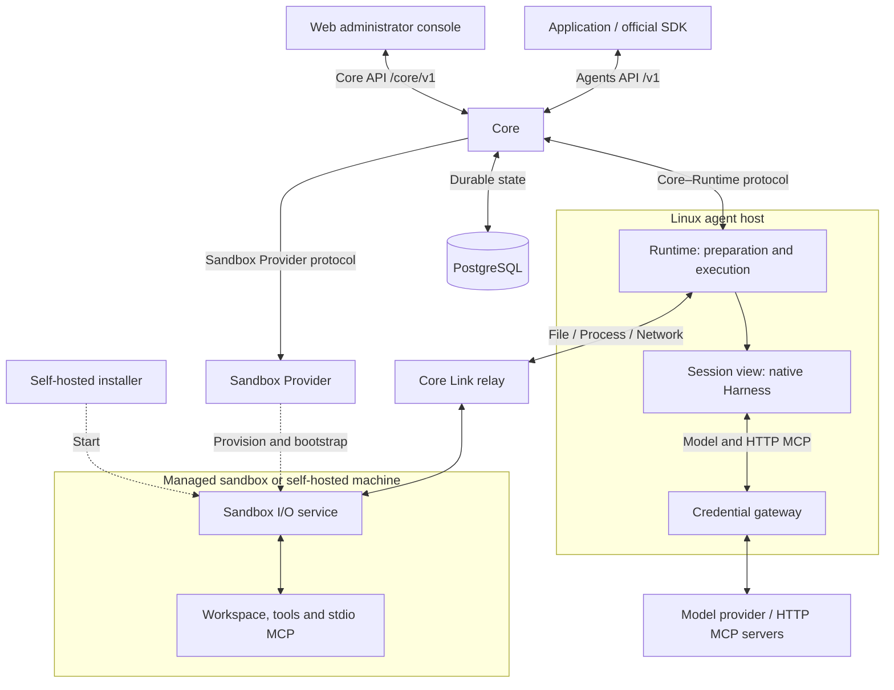

OpenAgentCore separates orchestration, compute and native execution. Core owns the API and durable state. Sandbox Providers manage compute. The Runtime runs on a Linux agent host near Core, prepares Environments through Sandbox I/O and runs each native Harness in a Session view. The Harness's upstream SDK or protocol owns the model and tool loop.

Dashed arrows show provisioning and installation. Solid arrows show component interactions, including in-process interfaces. The agent host connects to Core over an authenticated WebSocket; the agent host and Sandbox I/O connect to the Core Link relay. A Session with `environment: none` has an assignment and a private native home, with no sandbox workspace. The [API index](./api/index.md) describes the application, operator and machine namespaces; [protocol boundaries](https://github.com/MiniMax-AI/OpenAgentCore/blob/main/AGENTS.md#protocols-at-every-boundary) lists each protocol's code and owning document.

## Component responsibilities

| Component | Responsibility | Reference |
| --- | --- | --- |
| Core | Authenticate callers, resolve and freeze configuration, schedule Turns, handle cancellation and pending interactions, persist resources and execution facts in PostgreSQL | [Core service](https://github.com/MiniMax-AI/OpenAgentCore/blob/main/services/core/README.md) |
| Sandbox Provider | Create, observe, renew and reclaim compute; start the Sandbox I/O service in it | [Sandbox Provider](./sandbox-provider.md), [Sandbox bootstrap](./sandbox-bootstrap.md) |
| Sandbox node | Operate a Docker or microsandbox host and reconcile its assigned generation and allocations | [Sandbox node protocol](../contracts/agents-api/node-generation-protocol.md) |
| Runtime on the agent host | Prepare the workspace and capabilities through Sandbox I/O, manage Session views and Executors, execute Turns and report events and receipts | [Core–Runtime protocol](./runtime-protocol.md) |
| Sandbox I/O | Serve the sandbox's files, processes and network through the Core Link relay | [Sandbox link](./sandbox-link-protocol.md), [File access](./file-access-protocol.md), [Process](./process-protocol.md), [Network](./sandbox-network-protocol.md) |
| Credential gateway | Hold model and HTTP MCP credentials on the agent host and inject them into permitted upstream requests | [Model execution](../contracts/agents-api/model-execution.md#credential-gateway) |
| Harness adapter | Validate native configuration, invoke the upstream SDK or protocol, translate events and confirm native cleanup | [Harness onboarding](../contracts/agents-api/harness-onboarding.md) |
| Model provider | Serve the model protocol selected for the Harness | [Model execution](../contracts/agents-api/model-execution.md) |
| Web | Let administrators configure and observe the installation through a server-side Core API connection | [Console server](./web/console-server.md) |

The [repository map](./development.md#repository-map) locates these components. [Concepts](./concepts.md) explains Project boundaries, administrator authority and tool isolation.

## A Session, end to end

An application creates a Session through the Agents API. Core resolves and freezes its configuration. A managed Environment obtains compute through the selected Sandbox Provider; a self-hosted Environment waits for the user to run its installation command. In both cases Sandbox I/O must Serve the Environment's resource through the Link. The [application guide](./api/public-agent-api.md#create-a-session) describes these choices.

Core binds every Session to an agent host through a fenced [assignment](./runtime-protocol.md#session-assignments). For a Session with an Environment, its Link resource must be Serving before Core sends the bind; Core separately waits for the agent host's bound acknowledgement before preparation or execution. The Runtime prepares the Environment and its capability snapshot, then prepares or reuses the Session Executor. Each Turn runs through the native Harness. Core persists output, tool interactions and receipts for application reads and events. Completion or cancellation settles the Turn; a healthy Executor can serve the next Turn. Session deletion or Environment release releases the assignment.

Execution and compute have separate lifetimes: closing an Executor preserves its allocation and workspace until the Provider reclaims them. Preparation, connection and execution readiness have distinct states. The [Environment contract](../contracts/agents-api/environments.md) owns preparation, and the [Core–Runtime protocol](./runtime-protocol.md) owns ordering, receipts and failure handling.
