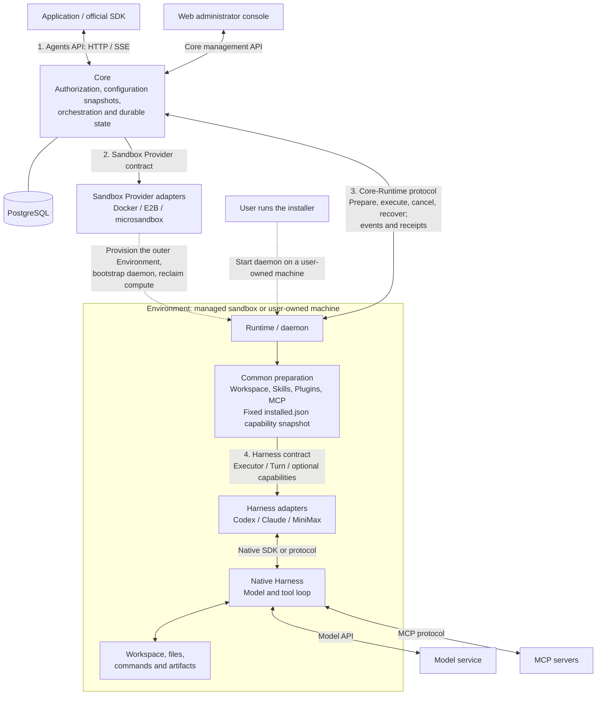

# Architecture

OpenAgentCore separates control, runtime and execution. Core owns durable state and the API; the Runtime daemon runs work inside an Environment; the native harness keeps its own model and tool loop. Each connection between them is a defined protocol, so any part can be replaced without changing Core orchestration.

This page is a map. Each section names a component, its boundary and the document that owns its rules.

Resource provisioning and task execution meet at the Runtime daemon. Managed sandboxes and user-owned machines enter through different setup paths, then use the same preparation and execution protocol.

Dashed arrows show provisioning and installation. Solid arrows show component interactions; they do not all imply network calls. Sandbox Provider and Harness contracts are primarily in-process interfaces. The daemon initiates the Core-Runtime WebSocket connection and exchanges ordered messages with Core. MCP servers may be local processes or remote services.

Each Harness adapter declares its supported model protocols. Core and Runtime validate that declaration; model calls use the Harness's own implementation. See [model execution](../contracts/agents-api/model-execution.md#saved-defaults-and-precedence).

## Two APIs, and a machine channel

Core serves three namespaces: the Agents API (`/v1`) for applications, the Core API (`/core/v1`) for operators, and a machine API (`/api/v1`) for nodes and Runtime daemons. Each has its own credential; one used elsewhere gets 401. The [API index](api/README.md) owns the full matrix of callers, credentials and routes.

## Core

Core is the only owner of durable execution facts: Projects and keys, Agents, Sessions, Turns, Items, Environments, files and audit records, all in PostgreSQL. It schedules Turns, handles cancellation and pending interactions, and checks that a requested harness, Environment and capability combination is supported before starting work.

Core does not isolate tools, run a model or talk to a vendor SDK directly. It reaches Sandbox Providers and Runtimes through the protocols below, and Harnesses only through the Runtime. The [repository map](development.md#repository-map) shows where each component lives.

## Protocol boundaries

The numbers below match the overview. Each protocol defines behavior, ownership, errors and completion semantics as well as types or method signatures. Its code and document are listed in [Protocols at every boundary](../AGENTS.md#protocols-at-every-boundary).

| Boundary | Responsibility |
| --- | --- |
| 1. Application / Core | Sessions, Turns, inputs, Items, files and events over HTTP / SSE |
| 2. Core / Sandbox Provider | Compute creation, observation, renewal, bootstrap and reclamation |
| 3. Core / Runtime | Capability declarations, preparation, execution, cancellation, recovery and receipts |
| 4. Runtime / Harness | Native configuration, execution, event translation and confirmed cleanup |
| Harness / Model Provider | Model inference through a protocol supported by the selected Harness |

The [bootstrap contract](runtime-bootstrap.md) carries the Runtime's startup input across the provisioning boundary. After connection, capability preparation belongs to Runtime; the Provider does not become a second execution path.

Not every combination of Harness, model and Environment works. The supported ones are recorded in [Harness selection](../contracts/agents-api/harness-selection.md) and the [coverage record](../contracts/agents-api/README.md).

## A Session, end to end

The application creates a Session through the Agents API. Core freezes its configuration and establishes the execution location:

- **Core-managed (`openai_hosted`):** the Sandbox Provider creates compute and bootstraps the daemon.
- **User-managed (`self_hosted`):** an administrator issues an executor credential; the user starts the daemon on their own machine ([self-hosted guide](getting-started/self-hosted.md)).
- **No workspace Environment (`none`):** Core uses an existing device connection with the selected Harness's qualified service profile.

For workspace Environments, the common path is:

1. Authenticate the daemon connection and check Harness availability.
2. Prepare the workspace and capabilities from the Session's frozen configuration.
3. Load the fixed installed capability snapshot and prepare or reuse the Session Executor.
4. Submit an input as a Turn; the native Harness runs its model and tool loop.
5. Return output, tool interactions and receipts to Core, which persists the execution state for application reads and events.
6. Confirm Turn settlement after completion or cancellation. A healthy Executor can serve the next Turn without destroying the Environment.

The `none` profile shares the execution protocol without workspace preparation. Compute availability, daemon connection, completed capability preparation and execution readiness are separate states. Sending a request is not proof that execution started or finished. See the [Environment contract](../contracts/agents-api/environments.md) for preparation and the [Core-Runtime protocol](runtime-protocol.md) for ordering, receipts and failure ownership.

## Boundaries to keep in mind

- **Isolation belongs to the outer Environment.** The daemon is not a sandbox ([Runtime and outer isolation](design-principles.md#runtime-and-outer-isolation)).
- **Execution and compute have separate lifetimes.** Closing an executor does not release its allocation, destroy its Environment or delete its workspace. Reclamation is an explicit Sandbox Provider operation.
- **Model keys stay with the compute that owns them.** A self-hosted Session brings its own model provider ([why](user-guide.md#which-model-provider-a-session-uses)).
- **Core Web is an administrator console.** It calls only `/core/v1` and cannot start Sessions or send input ([console API usage](web/console-api-usage.md#not-consumed)).
