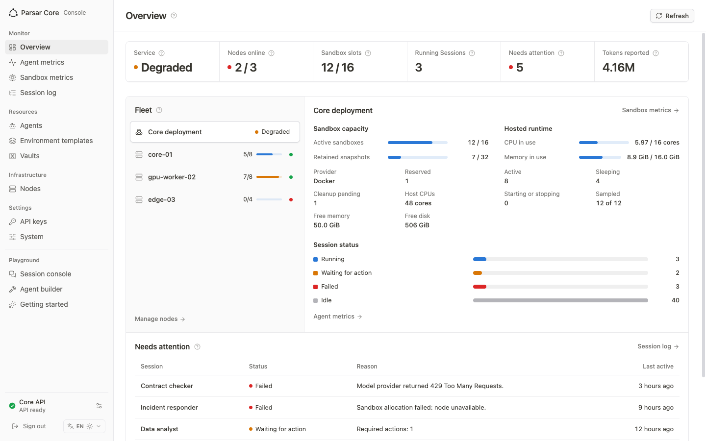
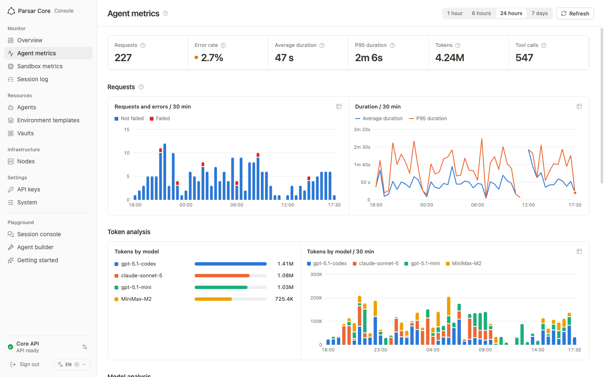

# Parsar Core Console

**English** | [简体中文](README.zh-CN.md)

The Parsar Core console (`apps/web`) is the operations back office for one
self-deployed Parsar Core. Applications call the OpenAI-compatible Agents API with
their own keys; the console is where the operator sees whether that service is
healthy, has capacity, how much it is used and where it fails. Business
collaboration belongs in Parsar; credentials and execution stay outside the
browser.



## Information architecture

| Group | Page | Purpose |
| --- | --- | --- |
| Monitor | Overview | Service health, nodes online, sandbox slots, running Sessions, work that needs attention; the fleet list (Core deployment and every node) with the selected target's capacity, host resources, hosted runtime use and allocations |
| Monitor | Agent metrics | Requests (Agent Turns), error rate, average and P95 duration, tokens and tool calls for 1 h / 6 h / 24 h / 7 d, broken down by model, tool and Agent |
| Monitor | Sandbox metrics | Node capacity table, hosted runtime CPU/memory/token history and the Runtime target explorer |
| Monitor | Session log | Every Session with status, model, environment and tokens; filter and open one in the Session console |
| Resources | Agents | Saved Agents in one table with per-Agent usage: Sessions by status, input/output/total/cached/reasoning tokens, usage coverage and last activity for all time, 7 d or 30 d; Sessions of deleted or inline Agents are kept under Other Agents |
| Resources | Environment templates, Skills, Vaults | Reusable hosted configuration shown in full, every uploaded Skill with its versions, and write-only MCP credentials |
| Resources | Files | Every file of the project, including API uploads: upload, copy the File ID, confirmed deletion |
| Infrastructure | Nodes | Enroll, inspect and remove execution nodes |
| Settings | API keys, System | Issue and revoke Agents API keys; read the Core build and startup configuration |
| Playground | Session console, Agent builder, Getting started | Debugging tools: chat with an Agent, build and edit saved Agents, replay the introduction |

Pages share one header (title, a circled help tip holding the explanation,
actions), one body rhythm, hairline-framed tables and charts, status dots and
capacity meters; explanations stay behind help tips instead of lines of small
print. Missing data is shown as missing (—), never as zero.

## How metrics are computed

Core has no aggregate endpoint yet, so the console derives figures from existing
reads and states their coverage on screen:

- Overview, Session log and Agents re-read the complete Session list and Runtime
  observations every 30 seconds while visible.
- Agents usage reads the Session list newest first in pages of 100 when the page
  opens or is refreshed, and stops once it passes the start of the selected
  range (Sessions are placed by `created_at`). Usage is each Session's cumulative
  total as reported by Core and is not split by day. Sessions without reported
  usage count toward coverage but not toward token sums; an Agent whose Sessions
  reported none shows "No data", not zero. The read can be cancelled, resumed
  after a failure, and is kept in page memory only.
- Agent metrics reads the Turns and Items of up to 200 most recently active
  Sessions in the selected range, with a 15-second limit per Session and a
  45-second budget per load. One request is one root Agent Turn; duration runs
  from `started_at` to `completed_at`; error rate is failed ÷ finished Turns;
  models come from each Session's Agent snapshot. Subagent Turns and deleted
  Sessions are not counted, and a page whose reads all failed says so instead of
  reporting no runs.
- Node and allocation data comes from the console-only `/core/v1/sandbox` routes;
  hosted CPU/memory history comes from Core's Runtime history.

The endpoints that would replace this browser work are proposed in
[Administrator metrics: backend requirements](admin-metrics-backend-requirements.md).

## Product tour

### Overview

The first viewport answers four questions: is the service healthy, is there
capacity, how much is running, and what needs attention. The fleet list on the
left starts with the Core deployment; selecting a node shows its slot usage, host
CPU/memory/disk, hosted runtime use of the Sessions placed on it, and its
allocations. The attention table lists failed Sessions and Sessions waiting for a
required action.

### Agent metrics

A time-range control scopes every figure on the page. Requests and errors are
stacked per interval, duration shows average and P95, and the Token, model and
tool sections pair a distribution with a trend. Colours follow each model or tool
while it stays visible, every chart has a data-table view, and the help tip beside the title
states how the figures are derived; a Partial data marker appears when the
Session cap or page limits cut the range short.



### Sandbox metrics

A node capacity table shows limits, usage, host resources and heartbeat per node.
Below it, hosted runtime history keeps CPU, memory and tokens from Core's periodic
observations; Web never connects to a database or receives telemetry credentials.
When a provider reports only cumulative CPU time, Web derives interval utilization
only across adjacent samples from the same verified Runtime incarnation.

### Session log and Session console

The Session log is the searchable record. Opening a Session moves to the Session
console, which keeps the conversation, trace, tool activity and follow-up input of
that Session in Core.

### Agents and Agent builder

The Agents page is an inventory. Editing, creating and starting a test Session
happen in the Agent builder under Playground.

### Environment Templates

In managed-Environment builds, open **Environment templates** to see every
reusable configuration, including templates created through the API. A template's
page shows its network mode and allowed domains, npm/Python/system packages,
capability directories, files (inline size or File ID, linked to Files), Skills
(ID or name with the default, `latest` or exact version, linked to Skills) and
Plugins. Environment variables and setup commands are confidential: Core never
returns them, so the console cannot tell whether a template has any. A template
with configuration this console does not recognize is marked, shows what it does
recognize, and never affects the other templates.

The console creates and edits only a template's name and network, including
`restricted` access with its domain list; an update sends just those fields, so
everything else is kept. Deletion is confirmed; existing Sessions are unaffected.
Saving a template does not start a Runtime or a model request, and any template,
however configured, can be selected when starting a managed Session.

### Files

**Files** lists every file of the project, including uploads made through the
Files API, with name, size, creation time, purpose and File ID, 100 at a time,
newest or oldest first. Upload a file of at most 512 MiB (empty files are allowed)
and copy its File ID to reference it from a template. If an upload or deletion
ends without a clear answer, the console does not retry it; refresh the list to
check first. Deleting a file does not affect copies already in Session workspaces
or existing Sessions, but new Sessions from templates that reference it will fail.

Known limits: the filter covers loaded rows only because Core has no file search;
user data files cannot be downloaded because Core rejects their content.

### Skills

**Skills** lists every Skill of the project, including those uploaded through the
API, with its default and latest version, creation time and ID. Upload a ZIP or a
folder whose single top-level folder contains `SKILL.md`; the dialog previews the
folder, file count, size and the frontmatter name and description before sending.
A Skill's page uploads new versions (optionally as the default), moves the default
pointer, downloads the default or an exact version, and deletes versions or the
whole Skill. Existing Sessions keep the Skill content they started with.

Known limits: Core has no Skill search, so the filter covers loaded rows only;
Core does not record who uploaded a Skill; browser checks are a convenience and
Core validates every upload. The entry is hidden when the connected Core has no
Skills API, and explains when Core has no Skill storage configured. Attaching
Skills to Environment templates is not available yet.

### System and connection status

System shows what the connected Core build supports and what this process
configured at startup: harnesses, daemon gateway, self-hosted execution, managed
sandbox provider and operator model endpoint presence. Configuration is never
presented as model execution readiness.

Capabilities appear only when the connected Core and the Web operator configuration
expose them.

## Quick start

### Requirements

- Node.js 22.12+
- pnpm 10.30.3
- a running [compatible Agent Core](#compatible-cores)
- a caller key issued by that Core's operator

### Start Web

```bash
git clone https://github.com/MiniMax-AI/parsar-core.git
cd parsar-core
pnpm install
cp .env.example .env.local
pnpm dev:web
```

The default development server opens on `http://127.0.0.1:4173` and proxies browser
requests to a Core on `http://127.0.0.1:8091`.

Configure the local proxy in `.env.local`:

```dotenv
AGENTS_API_PROXY_TARGET=http://127.0.0.1:8091
AGENTS_API_PROXY_TOKEN_FILE=/absolute/private/path/to/web-token
```

Only the local Web server reads the caller-key file. Do not place a plaintext key in a
`VITE_*` variable, URL, screenshot, Agent, Session metadata, or Git.

### First workflow

1. Open **Playground → Agent builder** and choose **Create agent**.
2. Set a name, model, and instructions; add supported tools only when needed.
3. Select **Start Session**, choose an Environment, and enter the first message for conversation-only execution. Hosted Sessions may be created without input.
4. Continue in **Session console** while live events and durable history update, then watch the run appear in **Overview** and **Agent metrics**.
5. Use **Trace**, **Vaults**, **Environment**, or **System** when the workflow needs them.

## Local Core and Docker

When Web cannot reach the local Core, Dashboard opens a connection guide with two paths:

- **Already set up** — start the configured database, Core API, and daemon containers,
  verify `/healthz`, then run **Test connection**.
- **First time on this computer** — build the Core image and follow the current
  in-repository guides to create the database, caller identity, migrations, API container, and daemon
  profile.

Enable the local recovery guide with the non-secret settings documented in
[`.env.example`](../../.env.example). Web displays reviewed commands but never receives the
Docker socket, executes commands, creates credentials, or invents database identities.

For complete setup, see [Connecting Agent Core](core-connection.md). Starting a
daemon can release queued work and trigger model usage; review pending Sessions first.

## Compatible Cores

Agents Core Web uses the tested `/v1/agents/**` HTTP and SSE contract documented in
[Protocol coverage](protocol-coverage.md).

| Core | Status |
| --- | --- |
| [Parsar Core at `0000a0b`](https://github.com/MiniMax-AI/parsar-core/tree/0000a0b32523deb0f7a4d907f31ca4503cff7e9e) | In-repository primary integration |
| Another Core implementing the documented subset | Compatible after contract qualification |
| OpenAI hosted Agents API | Complete compatibility is not claimed |
| OpenAI Agents SDK, Responses API, or Parsar daemon WebSocket | Different interfaces; not direct Core endpoints |

The browser talks to Core. Core owns authentication, durable Agent and Session state,
scheduling, execution, and runtime resources. The browser never connects directly to a
daemon or model provider.

## Documentation

- [Connecting Agent Core](core-connection.md) — local, remote, Docker, daemon and Environment setup
- [Protocol coverage](protocol-coverage.md) — tested resources, events and capability boundaries
- [Architecture](architecture.md) — components, ownership and trust boundaries
- [Roadmap](roadmap.md) — planned product and Core integrations
- [Administrator metrics: backend requirements](admin-metrics-backend-requirements.md) — console-only aggregate endpoints proposed for Core
- [Contributor policy](../../AGENTS.md) — repository scope, security and quality requirements

The screenshots use synthetic local data and do not contain production data or
prove model-provider readiness.

Agents Core Web is available under the [MIT License](../../LICENSE).
