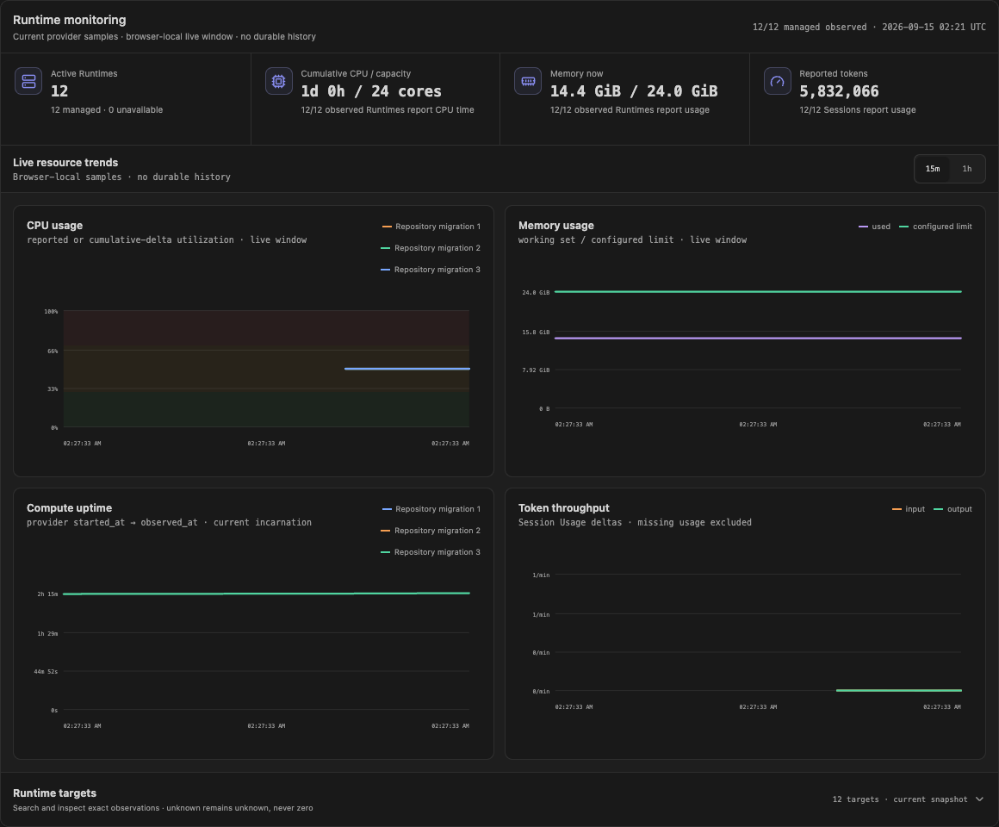

# Agents Core Web

[English](README.md) | **简体中文**

Agents Core Web 是一个开源的 AI Agent 工作台，用于创建 Agent、启动可持续的
Session、跟踪实时执行过程，并管理兼容 Agent Core 提供的资源。团队可以为自己的
Core 部署提供完整的产品界面，同时让凭据和执行能力始终留在浏览器之外。


## 可以做什么

- **通过 Dashboard 统一管理**：查看 Agent、活跃 Session、Runtime 当前 CPU/内存
  证据、计算运行时长、Token 覆盖率、需要关注的工作、最近活动和常用创建入口。
- **创建可复用 Agent**：从空白配置或实用模板开始，设置模型、指令、文本行为、
  Function 和 HTTP MCP 服务。
- **运行持久化对话**：创建 Session、发送消息、查看实时事件、重新打开历史工作、
  检查 Trace，并在 Turn 失败后继续对话。
- **安全使用工具**：检查 Function 调用、提交被请求的 Function 结果、查看命令和
  Patch 轨迹，并通过 Vault 绑定只写的 MCP 凭据。
- **选择执行 Environment**：使用 Core 默认执行链路、连接调用方管理的 self-hosted
  executor，或使用运维方启用的 managed Runtime。
- **理解连接状态**：查看 Core 可达性和已暴露能力；本地后端未就绪时获得明确的
  Docker 恢复步骤。

## 产品界面

### Dashboard

Dashboard 是默认首页，集中展示当前 Agent 和 Session 结果，并加载完整的租户级 Runtime
观测快照，不会把缺失值伪装成 0。支持搜索、状态/模式筛选、排序、分页的语义表格按需
展开；页面也展示需要关注的 Session，并可直接进入创建 Agent 或启动 Session 的流程。
Core 默认将周期采样存入现有 PostgreSQL，无需额外监控服务。页面通过 Core 查询
1 小时、6 小时和 24 小时历史，刷新后仍可读取。未启用执行 worker 的部署保留
浏览器本地 Live 视图。Token 速率来自 Session 的实际用量快照，缺失数据不按零计算。
Web 不直接访问数据库，也不接收监控凭据。运行时长只在当前/Live 视图展示；
历史图表保留 CPU、内存和 Token。



### Agents

Agent 是可以反复使用的工作配置。可以从空白 Agent 开始，也可以使用事故响应、
Slack 协作、数据分析、GitHub 问题调查和合同审阅模板。点击已有 Agent 会直接进入
编辑，也可以从卡片立即启动 Session。


### Sessions

Session 的对话和工作历史保存在 Core 中。一个页面同时提供 Session 导航、实时连接
状态、对话输出、Trace、工具活动和后续输入，不会丢失持久化记录。


### System 与连接状态

System 展示当前 Core 构建支持的 harness，以及本次进程启动时配置的 daemon gateway、
self-hosted、managed sandbox 和 LLM endpoint 是否存在。页面不聚合 Runtime/daemon
运行态，避免把已配置误认为模型执行链路已经就绪。


## 主要能力

| 区域 | 用户可以完成的工作 |
| --- | --- |
| Dashboard | 查看 Agent/Session 概览、Runtime 当前 CPU/内存/运行时长与 Token 覆盖率、关注队列、最近活动和快捷入口 |
| Agents | 创建、搜索、查看、编辑、删除、使用模板并启动 Session |
| Sessions | 持久化对话、按 Agent 筛选、实时事件、取消、重试和继续执行 |
| Trace | 查看 Turn 历史、Core 报告的 Usage、命令输出、Function 和 Patch 活动 |
| Functions 与 MCP | 配置支持的工具、查看调用、提交所需结果并绑定 Vault 凭据 |
| Vaults | 创建项目 Vault，管理只写 MCP Bearer 凭据，Web 不会读回 Token |
| Environments | 默认执行、可选 self-hosted executor 连接和可选 managed Runtime |
| Workspace 与 Files | 在 Core 支持时查看 Environment 文件并管理项目 Source Files |
| System | 查看连接、构建支持项和安全的进程启动配置，并与 Session/Environment 运行态明确分离 |

只有连接的 Core 和 Web 运维配置明确暴露的能力才会显示。Agent 保存成功只代表定义
已经持久化；实际执行仍依赖 Core 的运行时、模型提供商、凭据和工具连接。

## 快速开始

### 环境要求

- Node.js 22.12+
- pnpm 10.30.3
- 一个正在运行的[兼容 Agent Core](#兼容的-core)
- 由 Core 运维方签发的调用方密钥

### 启动 Web

```bash
git clone https://github.com/MiniMax-AI/parsar-core.git
cd parsar-core
pnpm install
cp .env.example .env.local
pnpm dev:web
```

开发服务器默认使用 `http://127.0.0.1:4173`，并把浏览器请求代理到
`http://127.0.0.1:8091` 的 Core。

在 `.env.local` 中配置本地代理：

```dotenv
AGENTS_API_PROXY_TARGET=http://127.0.0.1:8091
AGENTS_API_PROXY_TOKEN_FILE=/absolute/private/path/to/web-token
```

只有本地 Web 服务会读取调用方密钥文件。不要把明文密钥放进 `VITE_*` 变量、URL、
截图、Agent、Session metadata 或 Git。

### 第一个工作流

1. 打开 **Agents**，选择 **Create agent** 或一个入门模板。
2. 设置名称、模型和指令，只在需要时添加支持的工具。
3. 选择 **Start Session**，选择 Environment，并可同时发送第一条消息。
4. 在 **Sessions** 中继续工作，查看实时事件和持久化历史。
5. 工作流需要时再进入 **Trace**、**Vaults**、**Environment** 或 **System**。

## 本地 Core 与 Docker

Web 无法访问本地 Core 时，Dashboard 会打开连接引导，提供两条路径：

- **这台电脑已经配置过**：启动已配置的数据库、Core API 和 daemon 容器，验证
  `/healthz`，然后运行 **Test connection**。
- **这台电脑第一次使用**：构建 Core 镜像，并按照当前仓库内的文档创建数据库、
  调用方身份、迁移、API 容器和 daemon profile。

可使用 [`.env.example`](../../.env.example) 中的非秘密配置启用本地恢复引导。Web 只展示
经过校验的命令，不会获得 Docker socket、执行命令、创建凭据或猜测数据库身份。

完整步骤参见[连接 Agent Core](core-connection.md)。启动 daemon 可能释放已排队工作
并产生模型用量，操作前应先检查待处理 Session。

## 兼容的 Core

Agents Core Web 使用[协议覆盖范围](protocol-coverage.md)中经过测试的
`/v1/agents/**` HTTP 和 SSE 契约。

| Core | 状态 |
| --- | --- |
| [`0000a0b` 的 Parsar Core](https://github.com/MiniMax-AI/parsar-core/tree/0000a0b32523deb0f7a4d907f31ca4503cff7e9e) | 仓库内主要集成 |
| 实现了已记录子集的其他 Core | 完成契约验收后兼容 |
| OpenAI 托管 Agents API | 不承诺完全兼容 |
| OpenAI Agents SDK、Responses API 或 Parsar daemon WebSocket | 属于不同接口，不能作为 Core 地址直接连接 |

浏览器只连接 Core。鉴权、持久化 Agent/Session 状态、调度、执行和运行时资源都由 Core
负责；浏览器不会直接连接 daemon 或模型提供商。

## 文档入口

- [连接 Agent Core](core-connection.md) — 本地、远程、Docker、daemon 和 Environment 配置
- [协议覆盖范围](protocol-coverage.md) — 已测试资源、事件和能力边界
- [架构说明](architecture.md) — 组件、所有权和信任边界
- [路线图](roadmap.md) — 计划中的产品和 Core 集成
- [贡献者规范](../../AGENTS.md) — 仓库范围、安全和质量要求

README 截图使用隔离的本地 fixture 数据，不包含生产数据，也不能证明模型提供商已经就绪。

Agents Core Web 采用 [MIT License](../../LICENSE)。
