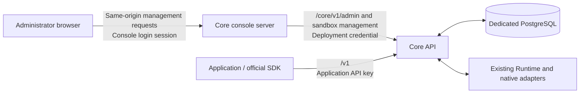

# Core Web architecture

## Status and scope

This document defines the administrator-console contract for the current management
API work. The existing React frontend has not yet migrated to this contract; its
migration owner and implementation remain pending. This document does not claim
that the current UI provides the management workflows described below.

Core Web manages a Core deployment. Applications, including Parsar, use the public
Agents API independently with their own API keys. Core, its PostgreSQL database,
console server and execution services remain independently deployable without the
Parsar product stack.

The [Core design principles](../design-principles.md) define identity and authority.
The [administrator API contract](../../contracts/agents-api/admin-api.md) defines
routes, response shapes, pagination, copy rules and audit records.

## Request boundaries

The frontend uses `AdminClient` from `packages/agents-client` for
`/core/v1/admin` and the existing sandbox management client for
`/core/v1/sandbox`. It does not use the public execution client for console
operations. The console server does not proxy `/v1` or hold an application API key.

The browser authenticates to the console. The console server keeps the deployment
credential private and supplies it to its configured Core upstream. Core rejects
API keys on administrator routes and deployment credentials on `/v1`. Forwarded
console account names are audit labels, not independent Core authorization.

## Ownership

| Component | Responsibility |
| --- | --- |
| Core Web | Key-space selection, resource inspection, permitted deletion/copy, key management and operational views |
| `AdminClient` | Typed management requests and response validation, reusing public resource projections where the wire objects match |
| Console server | Administrator login, same-origin request checks, management-route proxying and server-side deployment authentication |
| Core | Key-space isolation, resource state, deletion preconditions, atomic copies, audit/provenance and execution scheduling |
| Runtime and native adapters | Existing allocation, process lifecycle, execution and native protocol behavior |

The management API adds no execution path. Runtime ownership, native harness
behavior and the pinned public Agents API contract remain governed by
[CONTRIBUTING.md](../../CONTRIBUTING.md). Startup configuration and Runtime
observations are distinct: configured support does not prove a reachable model,
valid provider credentials or execution readiness.

## Keys and resources

One stable API-key resource owns one independent tenant. Creating a key creates a
space. Resetting its secret retains the key ID, tenant and assets, and invalidates
the previous secret. Revocation prevents new authentication but preserves assets
and already accepted execution. Revoked spaces remain available to administrator
queries. Core has no separate API-user or role model.

Administrators may inspect resource metadata and execution history, delete resources
under their existing deletion rules, and copy supported assets between spaces.
They cannot create or edit arbitrary user resources, start Sessions, submit input,
or cancel work through the management API. A busy Session therefore cannot be
made deletable by an implicit console cancellation.

Copies receive independent IDs. Core copies dependencies and rebinds encrypted
values internally in one transaction with its audit record. Sessions and Artifacts
are not copyable. Credential values and confidential template initialization remain
write-only; Skill source and Artifact content are readable, while Source File
content has no administrator download route.

## Console state and writes

Session inspection uses paginated durable history and bounded polling. The
management API has no Session SSE subscription or execution stream controller.
Changing the selected key space must abort or discard stale reads and pending
operation state so that results cannot appear under another space.

Deletion and copy require deliberate administrator actions. The client never
retries an uncertain write automatically. Key creation and secret reset return
plaintext once; ordinary reads never recover it. The UI must not persist that
plaintext in browser storage or logs. The API contract specifies explicit recovery
and idempotency behavior for each operation.
