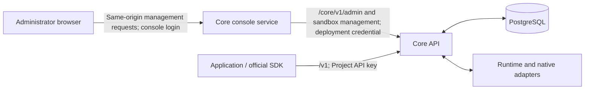

# Core Web architecture

Core Web manages a Core deployment. Applications, including Parsar, use the public
Agents API independently with their own Project keys. The management backend and
`AdminClient` are implemented; the frontend team owns the React migration. Existing
screens and their tests do not prove that the administrator UI is complete.

The [design principles](../design-principles.md) define identity and authority.
The [administrator contract](../../contracts/agents-api/admin-api.md) defines exact
routes, payloads, pagination, copy rules and audit records.

## Request boundaries

React management code must use `AdminClient` from `packages/agents-client`, plus the
existing sandbox management client for `/core/v1/sandbox`. The console service
returns 404 for `/v1`, including requests with an explicit Bearer token. It has no
application key and does not impersonate the selected Project.

The console authenticates the browser, checks the request origin and forwards only
allowed management routes. It replaces browser authorization and actor headers,
strips browser cookies, and supplies its server-side deployment credential. Core
rejects application keys on management routes and deployment credentials on `/v1`.
The forwarded console account name is an audit label, not Core authorization.

Fixed node enrollment and daemon transport routes retain their own credentials and
existing transport behavior. They do not grant a browser execution authority.

## Ownership

| Component | Responsibility |
| --- | --- |
| React frontend | Project selection, permitted management actions and operational views; migration owned by the frontend team |
| `AdminClient` | Typed management requests and validation, sharing resource parsers with the public client |
| `services/core-console` | Console authentication, origin checks, route allowlist and private upstream credential |
| Core API and PostgreSQL | Project isolation, resource state, deletion preconditions, atomic copies, audit and scheduling |
| Runtime and native adapters | Existing allocation, process lifecycle and execution protocols |

A Project owns one tenant and one principal; its keys have equal access to its
assets. Projects and keys are database records. Configuration contains deployment
settings, not business identities. Core has no separate API-user or role model.

Revoking one key prevents new authentication without removing assets or admitted
work. Archiving a Project disables all its keys and retains resources for
administrator inspection, deletion or copying to an active Project.

Management adds no execution path. It can inspect metadata and history, apply
existing deletion rules, and copy supported assets. It cannot edit arbitrary
resources, create Sessions, send input or cancel work. A deletion conflict cannot
be resolved by an implicit cancellation from the console.

Copies receive independent IDs. Core rewrites included dependencies and rebinds
stored encrypted values in one transaction with the copy receipt and audit record.
Sessions and Artifacts are not copyable. Secret fields remain write-only; Skill
source and Artifact content have explicit read routes, while Source File content
does not have an administrator download route.

## Deployment and application Runtime paths

Deployment sandbox management selects one provider at a time: E2B, Docker or
microsandbox. E2B uses the deployment's provider integration; Docker and microsandbox
use operator-managed machines. Provider setup, maintenance and node administration
belong to the existing sandbox management surface.

An application's `self_hosted` Runtime, including one it provisions in its own E2B
account, is a separate caller-managed path. It does not choose or reconfigure the
deployment provider. This console contract changes neither native Runtime protocols
nor application Session creation semantics.

## Frontend state and validation

Session inspection uses paginated durable history and bounded polling. There is no
management Session SSE endpoint. Project changes must discard stale reads and
pending operation state before displaying results in another Project.

The client sends each write once per explicit action. An uncertain result stays
visible until the administrator checks state and decides how to proceed. Issued
key plaintext must not enter browser storage or logs. Copy idempotency and key
issuance recovery follow the administrator contract.

Startup configuration describes configured support. It does not prove a reachable
model, valid provider credentials or execution readiness. Runtime observations,
usage coverage and audit history must retain the distinctions defined by Core.
Native execution ownership remains governed by [CONTRIBUTING.md](../../CONTRIBUTING.md).
