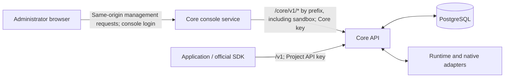

# Core Web architecture

Core Web manages a Core deployment. Applications, including Parsar, use the public
Agents API independently with their own Project keys. The management backend,
`AdminClient` and the React console built on them are implemented.

The [design principles](../design-principles.md) define identity and authority.
The [administrator contract](../../contracts/agents-api/admin-api.md) defines exact
routes, payloads, pagination and audit records.

## Request boundaries

React management code must use the Core clients from `packages/agents-client`:
`AdminClient` for `/core/v1`, `CoreMetricsClient` for `/core/v1/metrics` and the
sandbox management client for `/core/v1/sandbox`. The console service
returns 404 for `/v1` and `/api/v1`, including requests with an explicit Bearer
token. It has no application key and does not impersonate the selected Project.

The console signs the browser in with the Core key, checks the host and origin, and
forwards every signed-in `/core/v1/*` request to Core by prefix; Core alone decides
whether the route exists. It strips the browser's Authorization, Cookie, Origin and
Referer headers and supplies the Core key as its private upstream credential. Core
rejects application keys on management routes and the Core key on `/v1`.
The audit actor label is declared by the caller and is display only, never Core authorization: the console server declares `console`, and operator scripts calling Core with the Core key directly leave it empty.

Node and daemon connections use `/api/v1` with their own credentials. The reverse
proxy sends them directly to Core; the console never forwards them, and they do not
grant a browser execution authority.

## Ownership

| Component | Responsibility |
| --- | --- |
| React frontend | Project selection, permitted management actions and operational views; cached reads (TanStack Query) that keep the last data on screen while refreshing |
| `AdminClient` | Typed management requests and validation, sharing resource parsers with the public client |
| `services/core-console` | Core key login, host/origin checks, and prefix forwarding of `/core/v1/*` with the Core key as the private upstream credential |
| Core API and PostgreSQL | Project isolation, resource state, deletion preconditions, audit and scheduling |
| Runtime and native adapters | Existing allocation, process lifecycle and execution protocols |

A Project owns one tenant and one principal; its keys have equal access to its
assets. Projects and keys are database records. Configuration contains deployment
settings, not business identities. Core has no separate API-user or role model.

Revoking one key prevents new authentication without removing assets or admitted
work. Archiving a Project disables all its keys and retains resources for
administrator inspection and deletion.

Management adds no execution path. It can inspect metadata and history and apply
existing deletion rules. It cannot edit arbitrary resources, create Sessions, send
input or cancel work. A deletion conflict cannot be resolved by an implicit
cancellation from the console.

Secret fields remain write-only; Skill source and Artifact content have explicit
read routes, while Source File content does not have an administrator download
route.

## Deployment and application Runtime paths

Deployment sandbox management selects one provider at a time: E2B, Docker or
microsandbox. E2B uses the deployment's provider integration; Docker and microsandbox
use operator-managed machines. Provider setup, maintenance and node administration
belong to the existing sandbox management surface.

An application's `self_hosted` Runtime, including one it provisions in its own E2B
account, is a separate caller-managed path. It does not choose or reconfigure the
deployment provider. This console contract changes neither native Runtime protocols
nor application Session creation semantics.

## Frontend state and validation

Session inspection uses paginated durable history and bounded polling. There is no
management Session SSE endpoint. Project changes must discard stale reads and
pending operation state before displaying results in another Project.

The client sends each write once per explicit action. An uncertain result stays
visible until the administrator checks state and decides how to proceed. Issued
key plaintext must not enter browser storage or logs. Key issuance recovery
follows the administrator contract.

Startup configuration describes configured support. It does not prove a reachable
model, valid provider credentials or execution readiness. Runtime observations,
usage coverage and audit history must retain the distinctions defined by Core.
Native execution ownership remains governed by [CONTRIBUTING.md](../../CONTRIBUTING.md).
