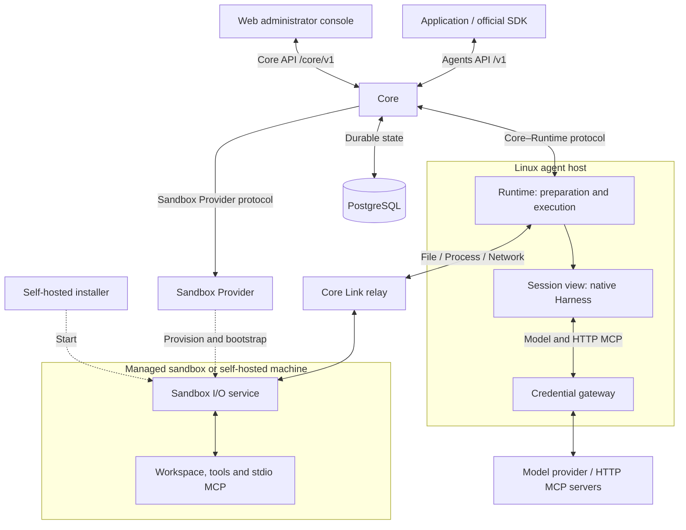

OpenAgentCore 将编排、计算资源和原生执行分开。Core 负责 API 和持久状态。Sandbox Provider 管理计算资源。Runtime 在 Core 附近的 Linux agent host 上运行，通过 Sandbox I/O 准备 Environment，并在每个 Session 的视图中运行原生 Harness。Harness 的上游 SDK 或协议负责模型与工具循环。

虚线表示资源创建与安装，实线表示组件交互，包括进程内接口。agent host 通过已认证的 WebSocket 连接 Core；agent host 和 Sandbox I/O 连接 Core Link relay。`environment: none` 的 Session 有 assignment 和私有原生 home，没有沙箱工作区。[API 索引](./api/index.md)说明应用、操作员和机器的命名空间；[协议边界](https://github.com/MiniMax-AI/OpenAgentCore/blob/main/AGENTS.md#protocols-at-every-boundary)列出每个协议的代码和拥有文档。

## 组件职责 {#component-responsibilities}

| 组件 | 职责 | 参考 |
| --- | --- | --- |
| Core | 认证调用方，解析并冻结配置，调度 Turn，处理取消和待处理交互，将资源与执行事实持久化到 PostgreSQL | [Core 服务](https://github.com/MiniMax-AI/OpenAgentCore/blob/main/services/core/README.md) |
| Sandbox Provider | 创建、观察、续期和回收计算资源；在其中启动 Sandbox I/O 服务 | [Sandbox Provider](sandbox-provider.md)、[沙箱引导](sandbox-bootstrap.md) |
| Sandbox node | 运行 Docker 或 microsandbox 主机，协调分配给它的 generation 与 allocation | [Sandbox node 协议](../../contracts/agents-api/zh/node-generation-protocol.md) |
| agent host 上的 Runtime | 通过 Sandbox I/O 准备工作区和能力，管理 Session 视图和 Executor，执行 Turn 并报告事件与回执 | [Core–Runtime 协议](./runtime-protocol.md) |
| Sandbox I/O | 通过 Core Link relay 提供沙箱文件、进程和网络服务 | [Sandbox link](./sandbox-link-protocol.md)、[文件访问](./file-access-protocol.md)、[进程](./process-protocol.md)、[网络](./sandbox-network-protocol.md) |
| 凭据网关 | 在 agent host 上持有模型和 HTTP MCP 凭据，并将其注入允许的上游请求 | [模型执行](../../contracts/agents-api/zh/model-execution.md#credential-gateway) |
| Harness adapter | 验证原生配置，调用上游 SDK 或协议，转换事件并确认原生清理完成 | [Harness 接入](../../contracts/agents-api/zh/harness-onboarding.md) |
| Model provider | 提供 Harness 选定的模型协议 | [模型执行](../../contracts/agents-api/zh/model-execution.md) |
| Web | 让管理员通过服务端 Core API 连接配置与观察安装实例 | [控制台服务端](web/console-server.md) |

[仓库地图](development.md#repository-map) 标出这些组件的位置。[概念](concepts.md) 解释 Project 边界、管理员权限和工具隔离。

## Session 的完整流程 {#a-session-end-to-end}

应用通过 Agents API 创建 Session。Core 解析并冻结其配置。托管 Environment 通过选定的 Sandbox Provider 获取计算资源；自托管 Environment 等待用户运行安装命令。两种情况下，Sandbox I/O 都必须通过 Link Serve 该 Environment 的资源。[应用指南](api/public-agent-api.md#create-a-session)说明这些选项。

Core 通过受约束的[分配](./runtime-protocol.md#session-assignments)把每个 Session 绑定到 agent host。对于带有 Environment 的 Session，Core 发送 bind 前，该 Environment 的 Link resource 必须处于 Serving；在准备或执行前，Core 还要单独等待 agent host 的 bound 确认。Runtime 准备 Environment 及其能力快照，然后准备或复用 Session Executor。每个 Turn 通过原生 Harness 运行。Core 持久化输出、工具交互和回执，供应用读取和接收事件。完成或取消使 Turn 结算；健康的 Executor 可以执行下一个 Turn。删除 Session 或释放 Environment 会释放该分配。

执行与计算资源拥有独立生命周期：关闭 Executor 后，其 allocation 和工作区保留到 Provider 回收为止。准备、连接和执行就绪具有不同状态。[Environment 契约](../../contracts/agents-api/zh/environments.md) 负责准备规则，[Core–Runtime 协议](runtime-protocol.md) 负责顺序、回执和故障处理。
